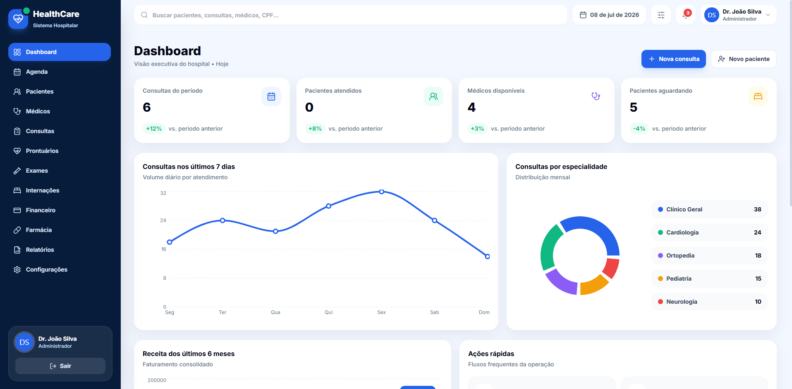
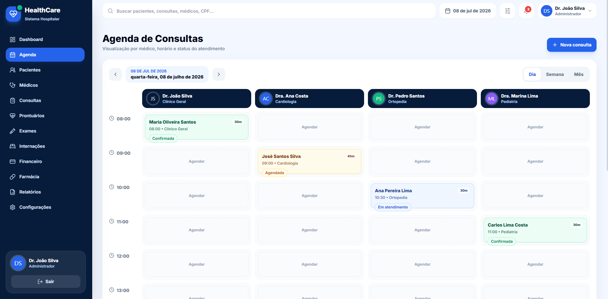
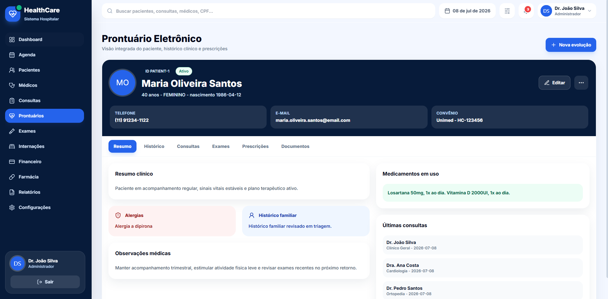

# 🏥 HealthCare - Sistema de Gestão Hospitalar

Sistema Full Stack de gestão hospitalar desenvolvido para simular uma plataforma SaaS utilizada por clínicas, hospitais e centros médicos.

O projeto contempla autenticação, dashboard analítico, agenda médica, prontuário eletrônico, gestão de pacientes, médicos e diversos módulos administrativos, aplicando boas práticas de arquitetura, segurança e desenvolvimento Full Stack.

---

## 🚀 Tecnologias

### Front-end
- React
- TypeScript
- Vite
- Material UI
- React Router

### Back-end
- Java 21
- Spring Boot 3
- Spring Security
- JWT
- Spring Data JPA
- Hibernate
- Flyway
- Bean Validation
- Swagger/OpenAPI

### Banco de Dados
- PostgreSQL

### DevOps
- Docker
- Docker Compose
- Nginx

---

## ✨ Funcionalidades

- ✅ Autenticação com JWT
- ✅ Controle de acesso por perfis
- ✅ Dashboard executivo
- ✅ Gestão de pacientes
- ✅ Gestão de médicos
- ✅ Agenda médica inteligente
- ✅ Gestão de consultas
- ✅ Prontuário eletrônico
- ✅ Gestão de exames
- ✅ Gestão de internações
- ✅ Controle financeiro
- ✅ Controle de farmácia
- ✅ Relatórios gerenciais
- ✅ Swagger/OpenAPI
- ✅ Seed automático para demonstração
- ✅ Banco versionado com Flyway
- ✅ Containerização com Docker

---

## 📸 Screenshots

<table>
<tr>
<td align="center">

### 🔐 Login


</td>
</tr>

<tr>
<td align="center">

### 📊 Dashboard



</td>
</tr>

<tr>
<td align="center">

### 📅 Agenda Médica



</td>
</tr>

<tr>
<td align="center">

### 📋 Prontuário Eletrônico



</td>
</tr>

</table>

---

## ⚙️ Como executar

```bash
git clone https://github.com/matheus-samuel-dev/sistema-gestao-hospitalar.git

cd sistema-gestao-hospitalar

docker compose up --build
```

A aplicação ficará disponível em:

- **Front-end:** http://localhost:3000
- **API:** http://localhost:8080
- **Swagger:** http://localhost:8080/swagger-ui.html

---

## 👥 Usuários de Demonstração

| Perfil | E-mail | Senha |
|---------|----------------------------|---------|
| Administrador | admin@healthcare.com | 123456 |
| Médico | medico@healthcare.com | 123456 |
| Recepção | recepcao@healthcare.com | 123456 |
| Financeiro | financeiro@healthcare.com | 123456 |

---

## 📚 Competências demonstradas

- Desenvolvimento Full Stack
- Arquitetura em camadas
- APIs REST
- Spring Security
- Autenticação JWT
- Controle de permissões
- React + TypeScript
- Java + Spring Boot
- PostgreSQL
- JPA / Hibernate
- Flyway
- Swagger
- Docker
- Docker Compose
- Nginx
- Boas práticas de arquitetura
- Interface responsiva

---

## 👨‍💻 Autor

**Matheus Samuel**

💼 LinkedIn  
https://linkedin.com/in/matheus-samuel-dev

💻 GitHub  
https://github.com/matheus-samuel-dev

🌐 Portfólio  
https://matheus-samuel-dev.github.io/Portfolio/
